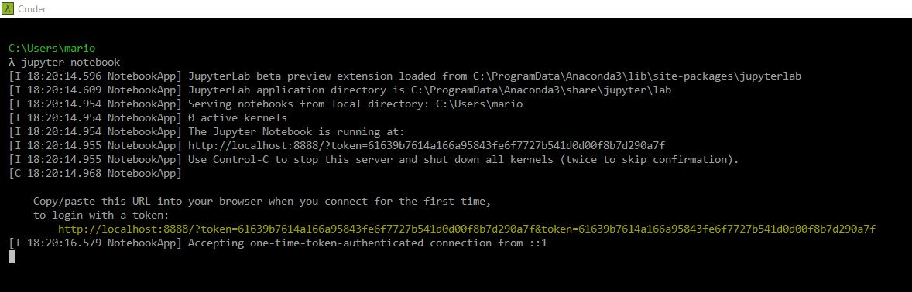

# Boston Housing Dataset

### Project for Machine Learning and Statistics

This repository contains my analysis of the Boston Housing dataset, and all associated files. You can view the jupyter notebook with my investigation, [here](https://nbviewer.jupyter.org/github/MarionMcG/boston_housing/blob/master/boston_housing.ipynb)

Note: Unable to download the dataset from kaggle.com link provided, I found the csv file [here](https://github.com/selva86/datasets/blob/master/BostonHousing.csv). 

### 1. Downloading an ipynb file from Github
* Click to open the file "boston-housing.ipynb" above.
* Right click on Raw, and select Save link as and choose the directory you want to save the file to. 

### 2. Opening an ipynb file on your machine
* Open a terminal, such as Command Prompt. I will be using [Cmdr.exe](http://cmder.net/)
* First, check if Jupyter is installed on your machine, using command, 'jupyter -- version'. You should also ensure Python is on your machine, by entering the command 'python --version'.

* If Jupyter Notebook is **not** installed, you should download [Anaconda](https://www.anaconda.com/download/) which supports Jupyter notebook files, and Python code. 
* Once Jupyter is installed, type the command, 'jupyter notebook' to open a static webpage displaying the folder you're currently in. You may need to copy and paste the URL (highlighted below) that appears on the command line, if a webpage doesn't automatically open. 

**NOTE:** When opening Jupyter notebook, ensure your downloaded ipynb file is in a subdirectory of the folder you are in. 
* From the webpage, navigate to the folder containing your ipynb file and click to open in a new tab. 

### 3. Running code from an ipynb file
Firstly as much of the code in this notebook is dependent on variables in previous cells, I would advise running all cells at the beginning. To do this, go to taskbar button Cell, and select Run All from the drop down menu. 

To run an individual code cell, you first need to be in command mode. In this mode there will be a blue line to the left of the cell. If you have selected a cell, but the line on the left is not blue, press Esc. 

Once in command mode, you can navigate up and down the notebook using arrow keys. 

You can also run an individual cell, by pressing Shift+p.
